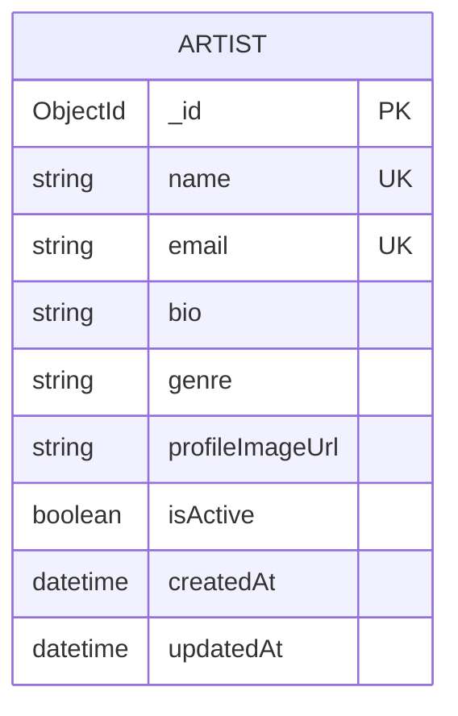

# Artist Service - ER Diagram

## Database Schema

## Description

The Artist Service manages artist information for the event ticket booking system.

### Entities:

#### Artist
- **_id**: Unique identifier (MongoDB ObjectId)
- **name**: Artist's name (required, unique)
- **email**: Artist's email address (required, unique, lowercase)
- **bio**: Artist biography
- **genre**: Music genre
- **profileImageUrl**: URL to profile image
- **isActive**: Active status (default: true)
- **createdAt**: Record creation timestamp
- **updatedAt**: Record update timestamp

## Key Features

- Single entity model for simplicity
- Email is unique to prevent duplicate artist entries
- Active status flag for soft deletion
- Timestamp tracking for audit purposes
