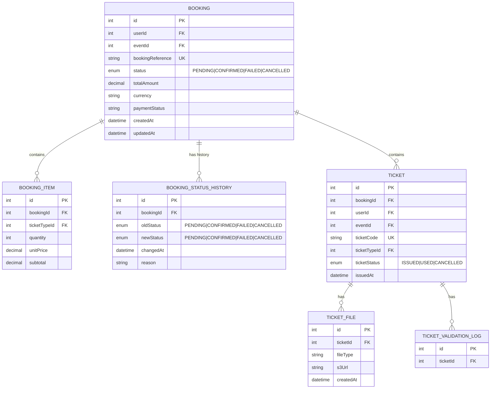

# Booking Service - ER Diagram

## Database Schema

## Description

The Booking Service manages ticket bookings, booking items, tickets, and validation information.

### Entities:

#### Booking
- **id**: Unique identifier (auto-increment)
- **userId**: External reference to user
- **eventId**: External reference to event
- **bookingReference**: Unique booking reference code
- **status**: Booking status (PENDING, CONFIRMED, FAILED, CANCELLED)
- **totalAmount**: Total booking amount
- **currency**: Currency code (3 chars)
- **paymentStatus**: Payment status
- **createdAt**: Booking creation timestamp
- **updatedAt**: Booking update timestamp

#### BookingItem
- **id**: Unique identifier (auto-increment)
- **bookingId**: Reference to Booking (FK, Cascade on delete)
- **ticketTypeId**: Reference to ticket type
- **quantity**: Number of tickets
- **unitPrice**: Price per ticket
- **subtotal**: Line total

#### BookingStatusHistory
- **id**: Unique identifier (auto-increment)
- **bookingId**: Reference to Booking (FK, Cascade on delete)
- **oldStatus**: Previous status
- **newStatus**: New status
- **changedAt**: Timestamp of status change
- **reason**: Reason for status change

#### Ticket
- **id**: Unique identifier (auto-increment)
- **bookingId**: Reference to Booking (FK, Cascade on delete)
- **userId**: External reference to user
- **eventId**: External reference to event
- **ticketCode**: Unique ticket code
- **ticketTypeId**: Reference to ticket type
- **ticketStatus**: Ticket status (ISSUED, USED, CANCELLED)
- **issuedAt**: Ticket issuance timestamp

#### TicketFile
- **id**: Unique identifier (auto-increment)
- **ticketId**: Reference to Ticket (FK, Cascade on delete)
- **fileType**: File type/format
- **s3Url**: S3 storage URL
- **createdAt**: File creation timestamp

#### TicketValidationLog
- **id**: Unique identifier (auto-increment)
- **ticketId**: Reference to Ticket (FK, Cascade on delete)

## Relationships

- **Booking ← BookingItem**: One-to-many (1 booking can have multiple items)
- **Booking ← BookingStatusHistory**: One-to-many (tracking booking status changes)
- **Booking ← Ticket**: One-to-many (1 booking can contain multiple tickets)
- **Ticket ← TicketFile**: One-to-many (ticket can have multiple files)
- **Ticket ← TicketValidationLog**: One-to-many (audit trail for ticket validation)

## Key Features

- Comprehensive booking lifecycle management
- Status history tracking for audit purposes
- Ticket file storage with S3 integration
- Cascade delete for maintaining referential integrity
- Indexed fields (userId, eventId, bookingId) for efficient querying
