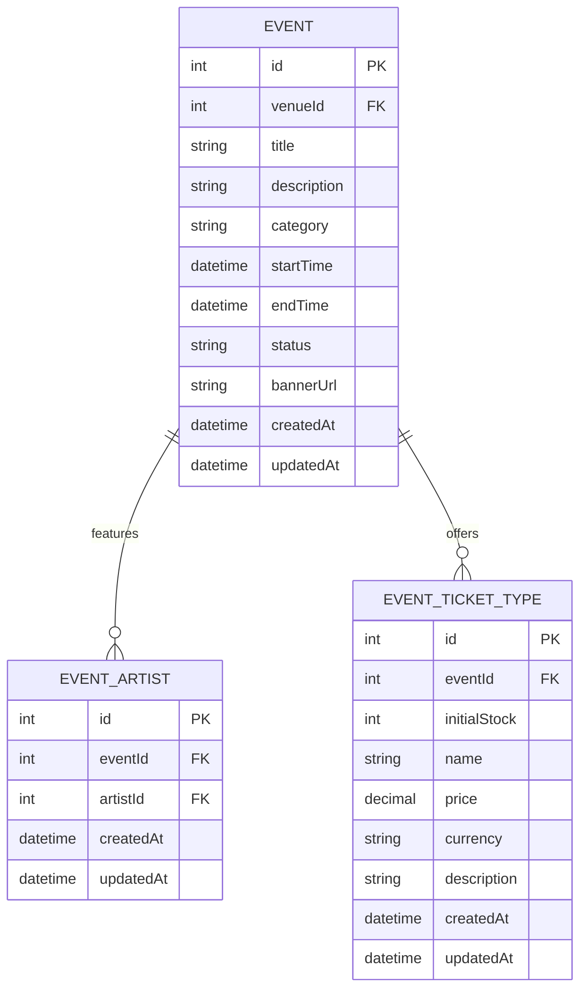

# Event Service - ER Diagram

## Database Schema

## Description

The Event Service manages events, event-artist relationships, and ticket types for events.

### Entities:

#### Event
- **id**: Unique identifier (auto-increment)
- **venueId**: Reference to venue
- **title**: Event title
- **description**: Event description
- **category**: Event category
- **startTime**: Event start datetime
- **endTime**: Event end datetime
- **status**: Event status (default: "draft")
- **bannerUrl**: URL to event banner image
- **createdAt**: Event creation timestamp
- **updatedAt**: Event update timestamp

#### EventArtist
- **id**: Unique identifier (auto-increment)
- **eventId**: Reference to Event (FK, Cascade on delete)
- **artistId**: Reference to Artist (external)
- **createdAt**: Assignment creation timestamp
- **updatedAt**: Assignment update timestamp
- **Composite unique constraint**: (eventId, artistId)

#### EventTicketType
- **id**: Unique identifier (auto-increment)
- **eventId**: Reference to Event (FK, Cascade on delete)
- **initialStock**: Initial ticket stock quantity
- **name**: Ticket type name (e.g., "VIP", "Standard")
- **price**: Ticket price
- **currency**: Currency code (default: "USD")
- **description**: Ticket type description
- **createdAt**: Ticket type creation timestamp
- **updatedAt**: Ticket type update timestamp

## Relationships

- **Event ← EventArtist**: One-to-many (1 event can have multiple artists, 1 artist can perform at multiple events)
- **Event ← EventTicketType**: One-to-many (1 event can have multiple ticket types)

## Key Features

- Event management with status tracking (draft, published, cancelled, ended)
- Many-to-many artist-event relationship
- Multiple ticket types per event for different pricing tiers
- Currency support for international events
- Cascading deletes to maintain referential integrity
- Timestamp tracking for audit purposes
- Indexed fields (venueId, eventId, artistId) for efficient querying
