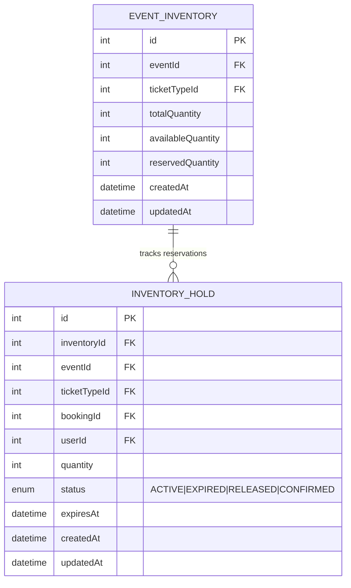

# Inventory Service - ER Diagram

## Database Schema

## Description

The Inventory Service manages ticket inventory and inventory holds for events.

### Entities:

#### EventInventory
- **id**: Unique identifier (auto-increment)
- **eventId**: Reference to event (FK)
- **ticketTypeId**: Reference to ticket type (FK)
- **totalQuantity**: Total number of tickets available
- **availableQuantity**: Number of available tickets
- **reservedQuantity**: Number of reserved tickets (default: 0)
- **createdAt**: Inventory record creation timestamp
- **updatedAt**: Inventory record update timestamp
- **Composite unique constraint**: (eventId, ticketTypeId)

#### InventoryHold
- **id**: Unique identifier (auto-increment)
- **inventoryId**: Reference to EventInventory (FK, Cascade on delete)
- **eventId**: Reference to event (FK)
- **ticketTypeId**: Reference to ticket type (FK)
- **bookingId**: Reference to booking (FK, optional)
- **userId**: Reference to user (FK)
- **quantity**: Number of tickets held
- **status**: Hold status (ACTIVE, EXPIRED, RELEASED, CONFIRMED)
- **expiresAt**: Hold expiration datetime
- **createdAt**: Hold creation timestamp
- **updatedAt**: Hold update timestamp

## Relationships

- **EventInventory ← InventoryHold**: One-to-many (1 inventory record can have multiple holds)

## Indexes

- EventInventory: (eventId), (ticketTypeId), unique (eventId, ticketTypeId)
- InventoryHold: (inventoryId), (eventId), (ticketTypeId), (bookingId), (userId), (expiresAt)

## Key Features

- Inventory tracking per event and ticket type
- Temporary hold mechanism for ticket reservations
- Hold expiration management to handle abandoned carts
- Status tracking (ACTIVE, EXPIRED, RELEASED, CONFIRMED)
- Multiple indexes for efficient querying by various criteria
- Reference to both user and booking for traceability
- Real-time availability calculation (availableQuantity = totalQuantity - reservedQuantity)
