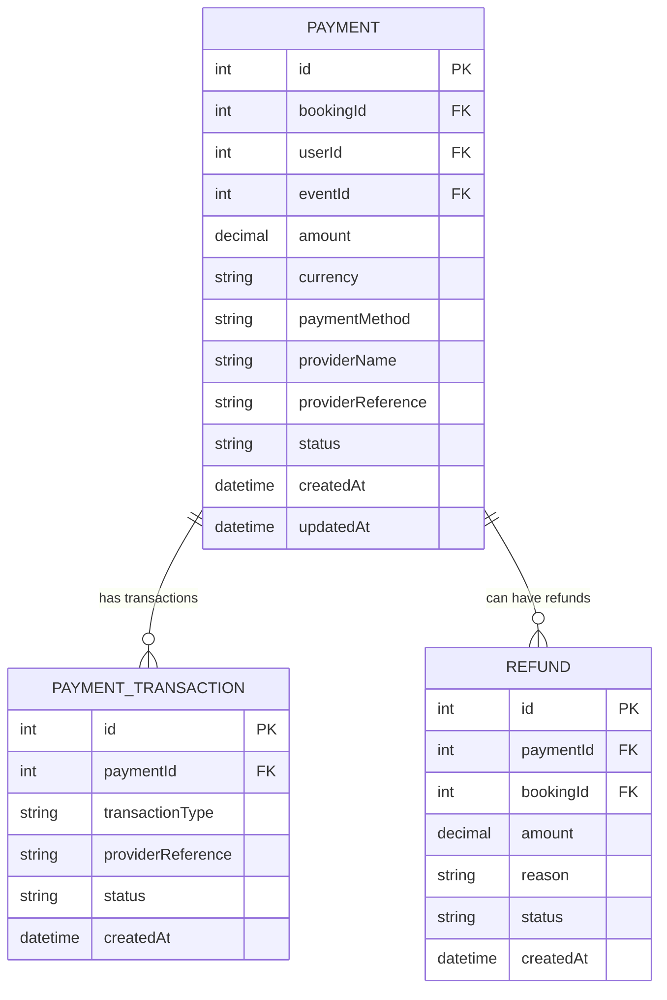

# Payment Service - ER Diagram

## Database Schema

## Description

The Payment Service manages payment processing, transactions, and refunds.

### Entities:

#### Payment
- **id**: Unique identifier (auto-increment)
- **bookingId**: Reference to booking (FK)
- **userId**: Reference to user (FK)
- **eventId**: Reference to event (FK)
- **amount**: Payment amount
- **currency**: Currency code
- **paymentMethod**: Payment method (e.g., "credit_card", "paypal")
- **providerName**: Payment provider name (e.g., "stripe", "paypal")
- **providerReference**: Provider's transaction reference ID
- **status**: Payment status (e.g., "pending", "completed", "failed")
- **createdAt**: Payment creation timestamp
- **updatedAt**: Payment update timestamp

#### PaymentTransaction
- **id**: Unique identifier (auto-increment)
- **paymentId**: Reference to Payment (FK, Cascade on delete)
- **transactionType**: Transaction type (e.g., "charge", "capture", "authorize")
- **providerReference**: Provider's transaction reference
- **status**: Transaction status (e.g., "success", "failed", "pending")
- **createdAt**: Transaction creation timestamp

#### Refund
- **id**: Unique identifier (auto-increment)
- **paymentId**: Reference to Payment (FK, Cascade on delete)
- **bookingId**: Reference to booking (FK)
- **amount**: Refund amount
- **reason**: Reason for refund
- **status**: Refund status (e.g., "pending", "completed", "failed")
- **createdAt**: Refund creation timestamp

## Relationships

- **Payment ← PaymentTransaction**: One-to-many (1 payment can have multiple transaction records)
- **Payment ← Refund**: One-to-many (1 payment can have multiple refunds)

## Indexes

- Payment: (bookingId), (userId), (eventId), (status), (providerReference)
- PaymentTransaction: (paymentId), (transactionType), (status), (providerReference)
- Refund: (paymentId), (bookingId), (status)

## Key Features

- Multi-step payment processing with transaction tracking
- Support for multiple payment providers
- Complete refund management
- JSON storage of provider responses for audit trails
- Status tracking for payments, transactions, and refunds
- External references to booking, user, and event
- Multiple indexes for efficient querying and reporting
- Cascading deletes maintain referential integrity
