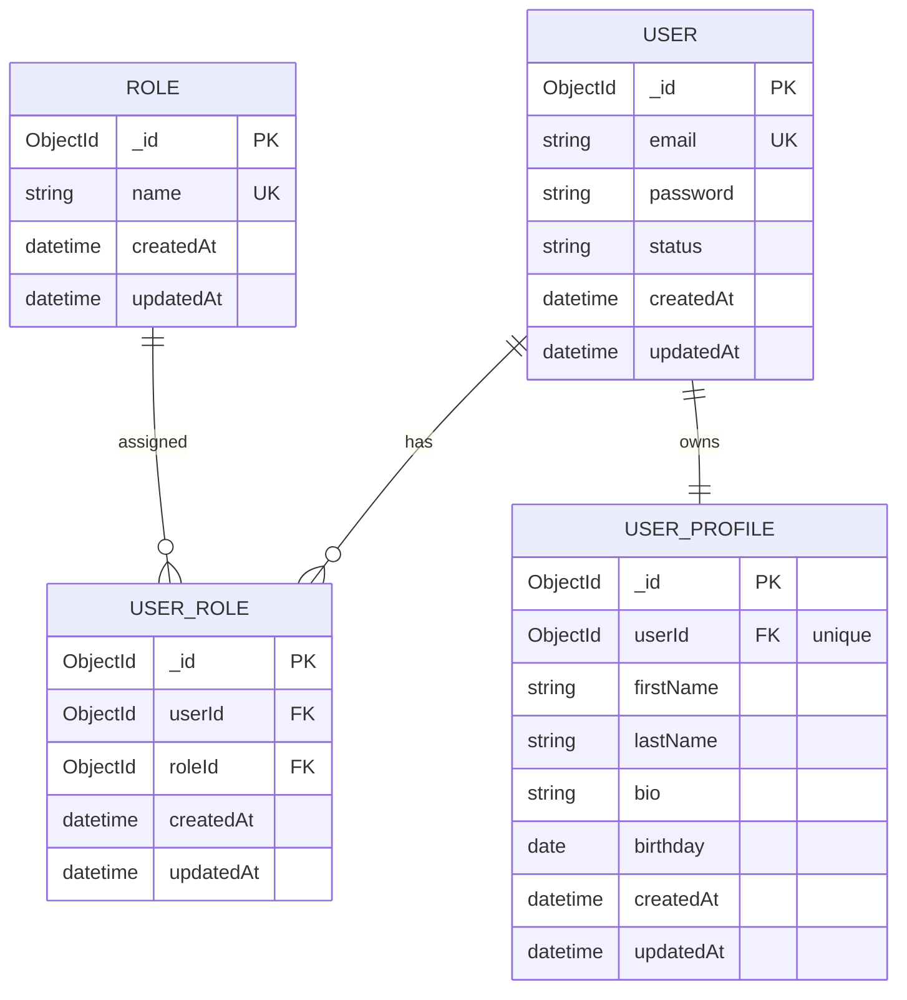

# User Service - ER Diagram

## Database Schema

## Description

The User Service manages user authentication, roles, and profile information.

### Entities:

#### User
- **_id**: Unique identifier (MongoDB ObjectId)
- **email**: User email (required, unique)
- **password**: Hashed password (required)
- **status**: Account status (default: "active")
- **createdAt**: Account creation timestamp
- **updatedAt**: Account update timestamp

#### Role
- **_id**: Unique identifier (MongoDB ObjectId)
- **name**: Role name (required, unique)
- **createdAt**: Role creation timestamp
- **updatedAt**: Role update timestamp

#### UserRole
- **_id**: Unique identifier (MongoDB ObjectId)
- **userId**: Reference to User (indexed)
- **roleId**: Reference to Role (indexed)
- **createdAt**: Assignment creation timestamp
- **updatedAt**: Assignment update timestamp
- **Composite unique index**: (userId, roleId)

#### UserProfile
- **_id**: Unique identifier (MongoDB ObjectId)
- **userId**: Reference to User (required, unique)
- **firstName**: User first name (required)
- **lastName**: User last name (required)
- **bio**: User biography
- **birthday**: User birthday
- **createdAt**: Profile creation timestamp
- **updatedAt**: Profile update timestamp

## Relationships

- **User → UserRole → Role**: Many-to-many relationship (user can have multiple roles)
- **User → UserProfile**: One-to-one relationship (each user has one profile)

## Key Features

- Role-based access control (RBAC) support
- Each user can have multiple roles
- User profile is optional but linked 1:1 to User if created
- Unique constraints prevent duplicate entries
