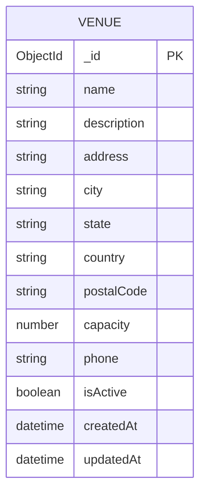

# Venue Service - ER Diagram

## Database Schema

## Description

The Venue Service manages venue/location information for events.

### Entities:

#### Venue
- **_id**: Unique identifier (MongoDB ObjectId)
- **name**: Venue name (required)
- **description**: Venue description
- **address**: Street address (required)
- **city**: City name (required, indexed for searching)
- **state**: State/Province
- **country**: Country name (required)
- **postalCode**: Postal/ZIP code
- **capacity**: Maximum venue capacity (required, minimum 1)
- **phone**: Contact phone number
- **isActive**: Active status flag
- **createdAt**: Record creation timestamp
- **updatedAt**: Record update timestamp

## Key Features

- Single entity model for venue information
- City is indexed for efficient venue searches by location
- Capacity validation (minimum 1)
- Active status flag for soft deletion
- Comprehensive location details (address, city, state, country, postal code)
- Timestamp tracking for audit purposes
